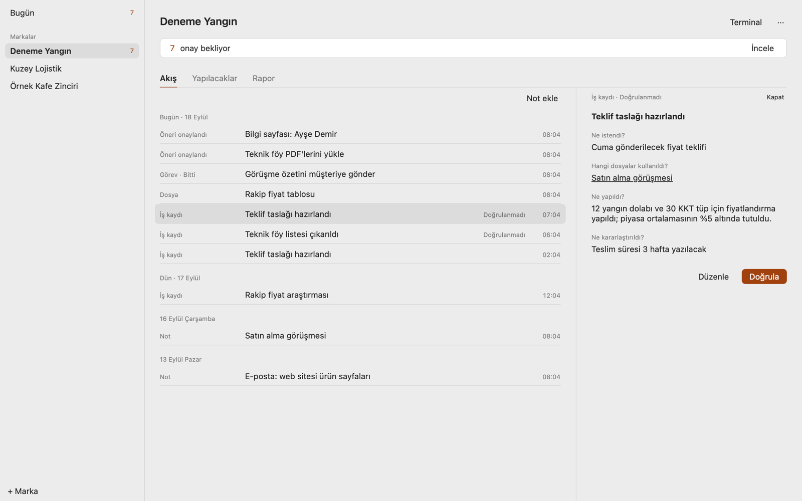
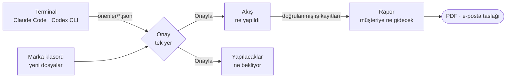
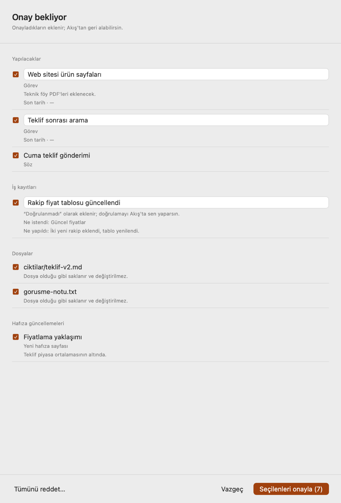
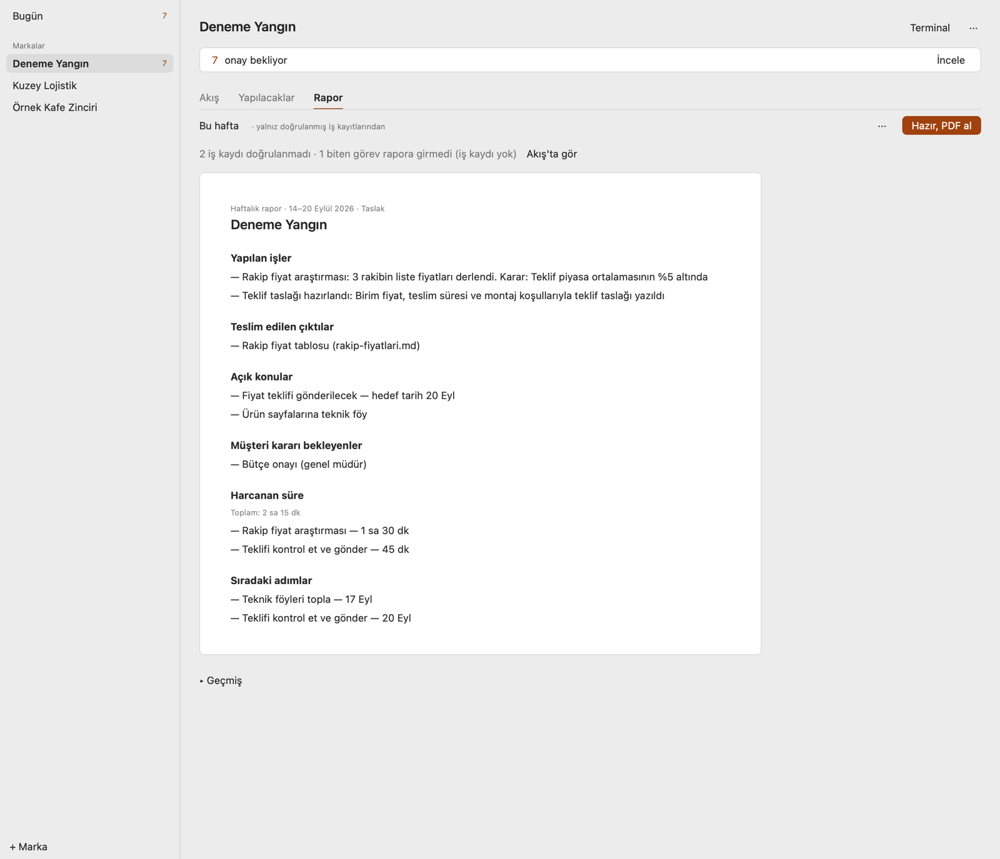
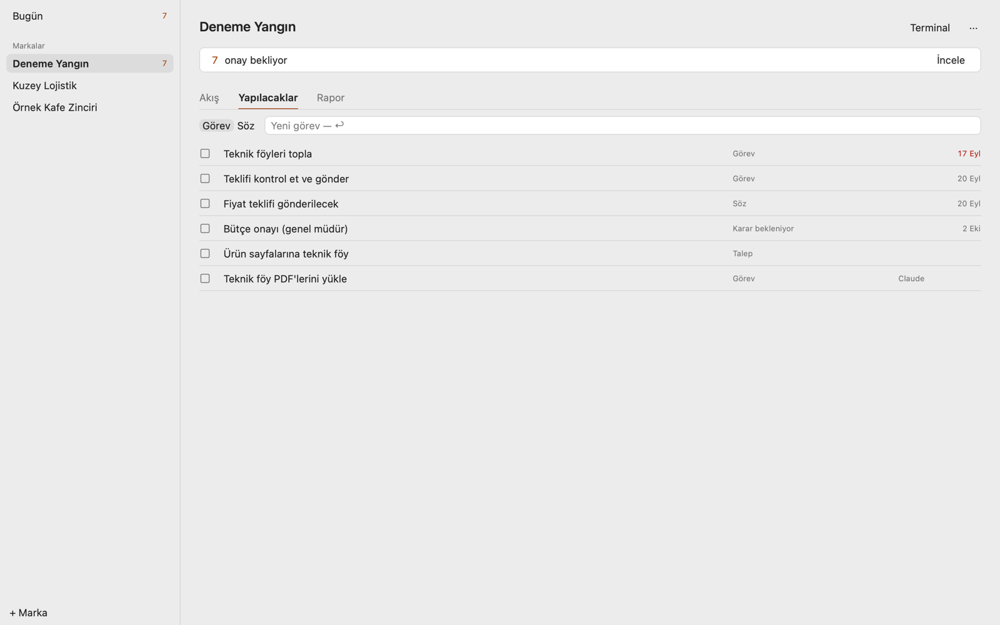
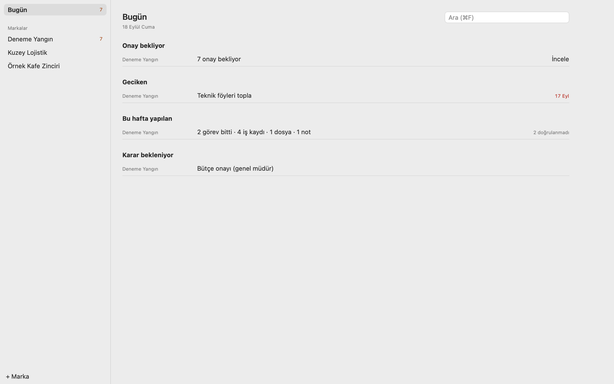

<div align="center">

# Marka Çalışma Alanı

**Brand Workspace** — birden fazla markaya hizmet veren danışman için yerel bir macOS uygulaması.

*Bir markaya bakınca: ne yapıldı, ne bekliyor, müşteriye ne gidecek.*

[](#hızlı-başlangıç)
[](Package.swift)
[](Sources/MarkaApp)
[](Sources/MarkaCore/Database)
[](docs/surum-0.2.1.md)
[](#lisans)

[Nasıl çalışır](#nasıl-çalışır) · [Öne çıkanlar](#öne-çıkanlar) · [Hızlı başlangıç](#hızlı-başlangıç) · [Güvenlik](#veri-ve-marka-yalıtımı) · [Durum](#durum) · [Belgeler](#belgeler)

<br>

<picture>
  <source media="(prefers-color-scheme: dark)" srcset="docs/images/akis-koyu.png">
  
</picture>

</div>

<br>

> Beta 0.2.1. Swift 6, SwiftUI, GRDB (SQLite). macOS 14 ve üzeri, Apple Silicon.

## Neden

İş artık terminalde, AI araçlarıyla yapılıyor: Claude Code, Codex CLI. Ama beş markaya hizmet veren biri için asıl soru değişmedi: *Bu markada en son ne yaptık, ne söz verdik, müşteriye ne göndereceğiz?*

Marka Çalışma Alanı bu soruyu tek ekranda cevaplar. Görevleri elle yazdırmaz. Terminalde çalışan AI yaptığını bildirir; sen bakar, onaylar ve cuma günü müşteriye gidecek raporu tek tıkla PDF olarak alırsın. Her şey senin Mac'inde kalır.

## Nasıl çalışır



1. **Çalış.** Her markanın kendi klasörü ve kendi terminali var. Terminaldeki AI, markanın `BAGLAM.md` dosyasını okuyup bağlamı hazır bulur.
2. **Aktar.** AI yaptığı işi, açtığı görevleri ve verilen sözleri `oneriler/` klasörüne küçük bir JSON dosyası olarak yazar. Uygulamanın veri tabanına kendisi yazamaz; bu bilerek böyle.
3. **Onayla.** Uygulama dosyayı görür: *"5 onay bekliyor · İncele"*. Seçtiklerini onaylarsın; her onay geri alınabilir.
4. **Raporla.** Rapor yalnızca doğrulanmış iş kayıtlarından oluşur, her maddenin bir dayanağı vardır. *Hazır, PDF al* ile filigransız PDF'i kaydedersin.

## Öne çıkanlar

| | |
|---|---|
| **Üç soru, üç bölüm** | Marka ekranında yalnız *Akış* (ne yapıldı), *Yapılacaklar* (ne bekliyor) ve *Rapor* (müşteriye ne gidecek) var. Braun ilkesiyle sadeleştirildi: 4 yazı stili, tek vurgu rengi, kart ve süs yok. |
| **Tek onay yeri** | Terminalden gelen öneriler ve klasöre düşen yeni dosyalar aynı sayfada onaylanır. Seçmediklerin bekler, hiçbir şey sessizce reddedilmez. |
| **Marka başına terminal** | Her marka kendi klasöründe gerçek bir kabukla açılır. Markalar arasında geçince oturum kapanmaz; Claude Code seni kaldığın yerde bekler. |
| **Marka yalıtımı** | Terminal ve Codex süreci, macOS sandbox profiliyle başka markanın klasörünü ve uygulamanın verisini okuyamaz, yazamaz. [Ayrıntı ↓](#veri-ve-marka-yalıtımı) |
| **Dayanaklı rapor** | Rapordaki her madde doğrulanmış bir iş kaydına bağlıdır. AI özeti, dayanak göstermeyen cümleyi atar. |
| **Değişmez kaynak** | Eklenen dosya ve notlar bir SQL tetikleyicisiyle korunur; değiştirilemez, yalnızca arşivlenir. Her yazma işlemi denetim kaydı bırakır. |
| **Yerel ve senin** | Veri SQLite'ta, Mac'inde durur. Her gün otomatik yedek alınır. AI isteğe bağlıdır ve marka başına izinle açılır. |

<table>
  <tr>
    <td width="50%"><br><sub><b>Onay</b>: terminalden gelen öneriler ve yeni dosyalar tek yerde.</sub></td>
    <td width="50%"><br><sub><b>Rapor</b>: doğrulanmış iş kayıtlarından canlı önizleme.</sub></td>
  </tr>
  <tr>
    <td><br><sub><b>Yapılacaklar</b>: görev, söz, beklenen karar ve talep tek listede.</sub></td>
    <td><br><sub><b>Bugün</b>: tüm markalarda onay bekleyen, geciken, bu hafta yapılan.</sub></td>
  </tr>
</table>

<sub>Ekran görüntüleri sahte örnek veriyle (`MarkaDogrula demo`) uygulamanın kendi çizim kipinde alınmıştır.</sub>

## Hızlı başlangıç

**Gereksinimler:** macOS 14 veya üzeri, Apple Silicon, Xcode Command Line Tools (`xcode-select --install`). Xcode gerekmez.

```sh
git clone https://github.com/suleymanbagirgan/brand-workspace.git
cd brand-workspace
scripts/build-app.sh                  # dist/Marka Çalışma Alanı.app
open "dist/Marka Çalışma Alanı.app"
```

İlk açılışta yalnızca ilk markanın adı sorulur. Marka klasörü `~/Documents/Marka Çalışma Alanı/<marka>` altında oluşur. Terminali <kbd>⌘</kbd><kbd>J</kbd> ile aç.

<details>
<summary><b>Terminaldeki AI'dan uygulamaya aktarım: örnek öneri dosyası</b></summary>

<br>

Claude Code'a *"yaptıklarımızı aktar"* dediğinde marka klasörüne şöyle bir dosya yazması beklenir. Tam şema her markanın `BAGLAM.md` dosyasında durur.

```json
{
  "surum": 1,
  "gorevler": [
    { "baslik": "Ürün sayfalarına teknik föy", "durum": "yapilacak", "sonTarih": "2026-09-30" }
  ],
  "calismaKayitlari": [
    { "baslik": "Rakip fiyat tablosu güncellendi",
      "neIstendi": "Güncel fiyatlar",
      "neYapildi": "İki yeni rakip eklendi, tablo yenilendi." }
  ],
  "kayitlar": [
    { "tur": "soz", "baslik": "Cuma teklif gönderimi", "sonTarih": "2026-09-26" }
  ]
}
```

Dosya `oneriler/2026-09-18-teklif.json` gibi bir adla kaydedilir. Uygulama, marka ekranı açıkken onu birkaç saniye içinde görür, işledikten sonra `oneriler/islenmis/` altına taşır. Dosyadaki marka adı yok sayılır; öneri yalnızca dosyanın bulunduğu markaya gider.

</details>

<details>
<summary><b>Geliştirici komutları</b></summary>

<br>

```sh
scripts/test.sh                       # 133 test (Swift Testing)
python3 scripts/l10n.py check         # TR/EN çeviri ve çoğul kapsamı
scripts/ui-olcum.sh                   # arayüz sadelik ölçümü
scripts/release.sh                    # dist/MarkaCalismaAlani-<sürüm>.dmg
swift run MarkaDogrula codex          # gerçek Codex App Server ile uçtan uca doğrulama
swift run MarkaDogrula demo <klasör>  # sahte örnek çalışma alanı
```

Ekran çizimi, deneme veri alanı ve canlı Claude doğrulaması: [docs/gelistirme.md](docs/gelistirme.md).

</details>

| Kısayol | |
|---|---|
| <kbd>⌘</kbd><kbd>0</kbd> | Bugün |
| <kbd>⌘</kbd><kbd>1</kbd> · <kbd>2</kbd> · <kbd>3</kbd> | Akış · Yapılacaklar · Rapor |
| <kbd>⌘</kbd><kbd>J</kbd> | Terminal |
| <kbd>⌘</kbd><kbd>F</kbd> | Tüm markalarda ara |
| <kbd>⇧</kbd><kbd>⌘</kbd><kbd>N</kbd> | Yeni marka |

## Veri ve marka yalıtımı

Danışman için en büyük risk, bir müşterinin bilgisinin başka bir müşteriye sızmasıdır. Bu yüzden:

- **Terminal ve Codex süreci sandbox'ta çalışır.** Başka markaların klasörleri ve uygulama verisi okunamaz, yazılamaz. `open`/LaunchServices, AppleEvents ve yerel Unix soketleri gibi sandbox dışına süreç kaçırma yolları da kapalıdır. Kabuk başlangıç dosyalarına ve araç ayarlarına yazılamaz. Bu kurallar gerçek süreçlerle ölçülerek doğrulandı.
- **Uygulama sembolik bağı izlemez.** Marka klasörü dışını gösteren dosya içe alınmaz.
- **AI veri değiştirmez, öneri üretir.** Senin onayın olmadan hiçbir kayıt oluşmaz. Onaylanan her şey geri alınabilir.
- **Tanı bilgisi içerik taşımaz.** Marka adı, dosya metni, e-posta ya da dosya yolu yazılmaz; bir test bunu ayırt edici içerikle doğrular.

Açık kalan sınırlar: ağ erişimi açıktır, pano (`pbpaste`) okunabilir, başka bir markanın klasörünün *var olup olmadığı* çıkarılabilir (içeriği okunamaz). Hepsi [bilinen sınırlar](docs/bilinen-sinirlar.md) belgesinde.

## Durum

**Beta 0.2.1.** 133 test geçiyor, veri modeli ve güvence kuralları testli. Ama kısa bir dürüstlük notu:

- Arayüz yalnızca uygulamanın kendi çizim kipinde ve testlerle doğrulandı; **tıklanarak henüz denenmedi**. Elle deneme turu: [docs/elle-test-senaryosu.md](docs/elle-test-senaryosu.md).
- Claude API gerçek bir anahtarla denenmedi. Codex App Server gerçek hesapla uçtan uca doğrulandı.
- Gerçek bir Claude Code oturumunun `oneriler/` dosyasını talimata uygun yazdığı henüz gözlenmedi.
- Paket ad-hoc imzalıdır; başka bir Mac'te Gatekeeper uyarısı verir. Yalnızca Apple Silicon.

Tam liste: [docs/bilinen-sinirlar.md](docs/bilinen-sinirlar.md).

### Yol haritası

- [x] **0.1.0**: Çekirdek, AI katmanı, raporlar, yedekleme
- [x] **0.2.0**: Marka yalıtımı, beta paketi, içeriksiz tanı raporu, terminalden öneri köprüsü
- [x] **0.2.1**: Braun sadeleştirmesi: 3 bölüm, tek onay yeri, kalıcı terminal oturumu
- [ ] **0.2.2**: Onay = doğrulama (terminalden gelen iş kaydını onaylamak onu doğrular)
- [ ] 5 danışmanla iki haftalık beta ([değerlendirme planı](docs/degerlendirme-plani.md))
- [ ] Developer ID ile imzalı ve notarize dağıtım

## Belgeler

| Belge | İçerik |
|---|---|
| [Kullanım kılavuzu](docs/kullanim-kilavuzu.md) | Ekran ekran ayrıntılı anlatım ve güvence kuralları |
| [Bilinen sınırlar](docs/bilinen-sinirlar.md) | Doğrulanmayan ya da bilerek bırakılan her şey |
| [Geliştirme](docs/gelistirme.md) | Derleme, test, ekran çizimi, canlı doğrulama araçları |
| [0.2.1 planı](docs/surum-0.2.1.md) | Sadelik planı ve ölçülmüş sonuçlar |
| [Dağıtım ve sağlayıcılar](docs/dagitim-ve-saglayicilar.md) | App Store ve doğrudan dağıtım, Claude ve Codex koşulları |
| [Beta kurulumu](docs/beta-kurulum.md) | Katılımcı için adım adım kurulum |

## Teknoloji

Swift 6 · SwiftUI · [GRDB.swift](https://github.com/groue/GRDB.swift) 7.11 (SQLite, WAL, tetikleyiciler) · [SwiftTerm](https://github.com/migueldeicaza/SwiftTerm) 1.19 (PTY terminal) · macOS seatbelt (`sandbox-exec`) · Anthropic Messages API · OpenAI Codex App Server

```
Sources/
├── MarkaCore/      veri modeli, SQLite şeması, marka yalıtımı, AI sağlayıcıları, raporlar, yedek
├── MarkaApp/       SwiftUI arayüzü (Bugün, Akış, Yapılacaklar, Rapor, terminal)
└── MarkaDogrula/   canlı doğrulama aracı (gerçek Codex ve Claude ile, sahte veriyle)
Tests/MarkaCoreTests/  133 test
```

## Lisans

Tüm hakları saklıdır. Kaynak kodu inceleme amacıyla herkese açıktır; kopyalama, değiştirme ve dağıtım için izin verilmez. Üçüncü taraf bileşenler: [THIRD_PARTY_NOTICES.md](THIRD_PARTY_NOTICES.md). Geliştirmede kullanılan BMAD Method (MIT) depoya dahil değildir.

<div align="center">
<sub>Weniger, aber besser.</sub>
</div>
