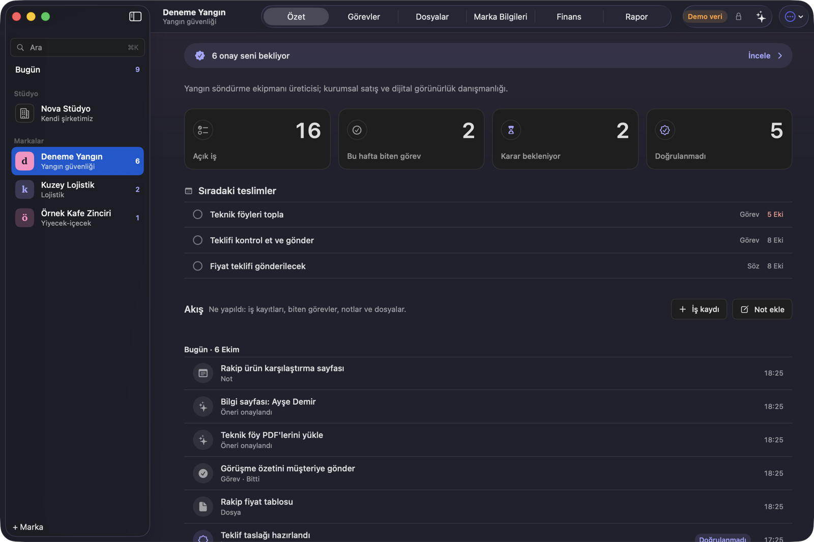
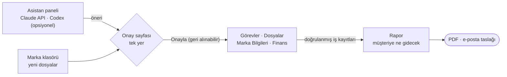
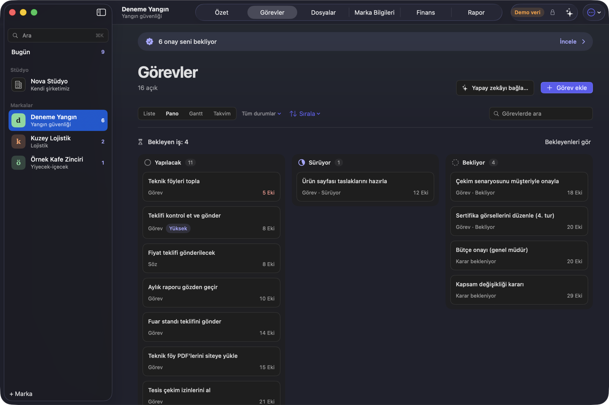
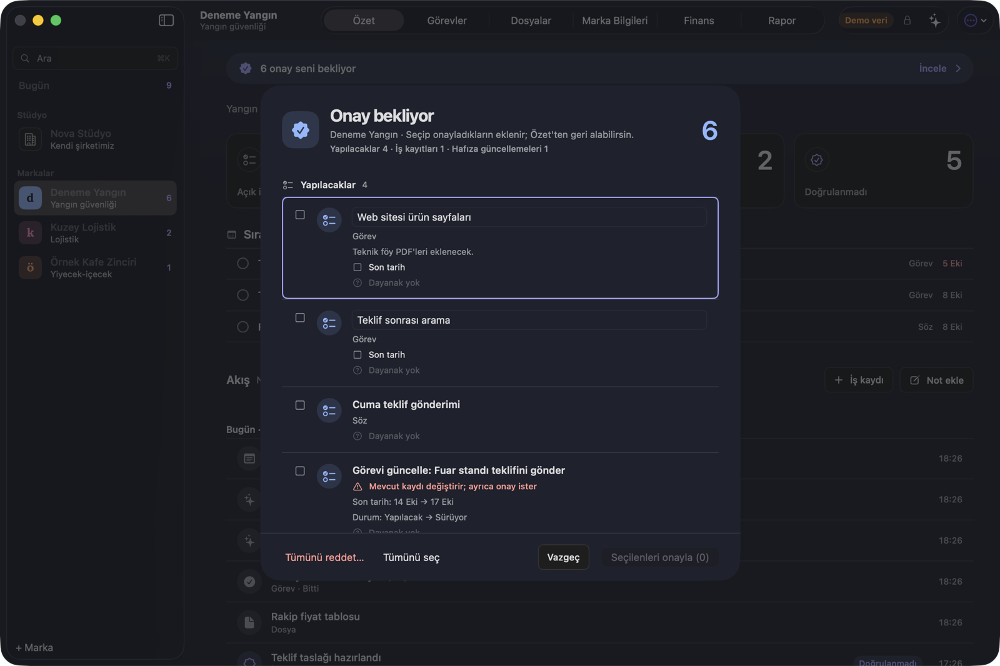
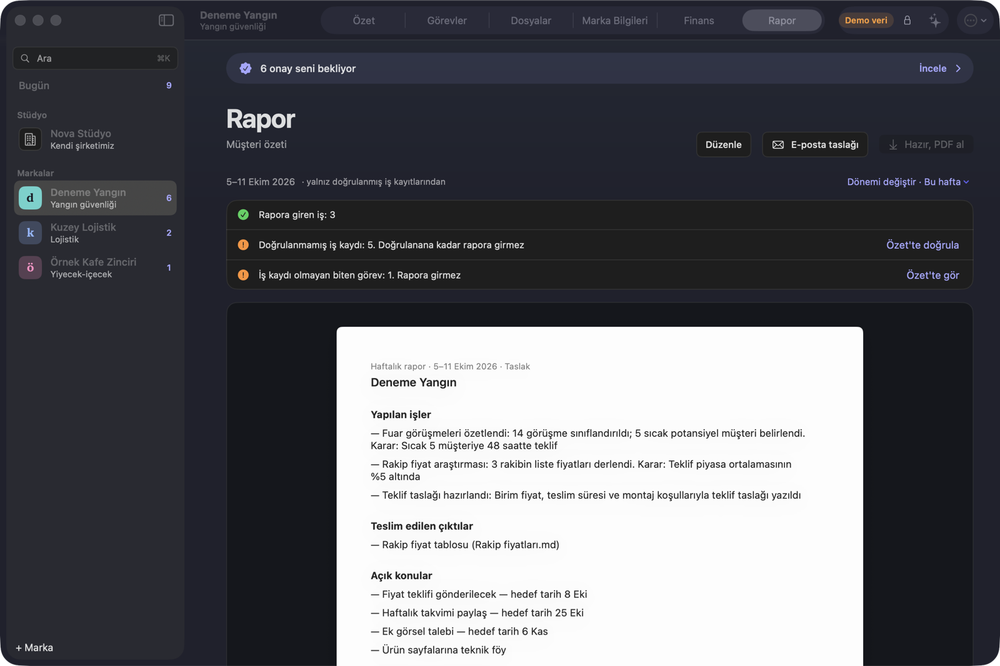
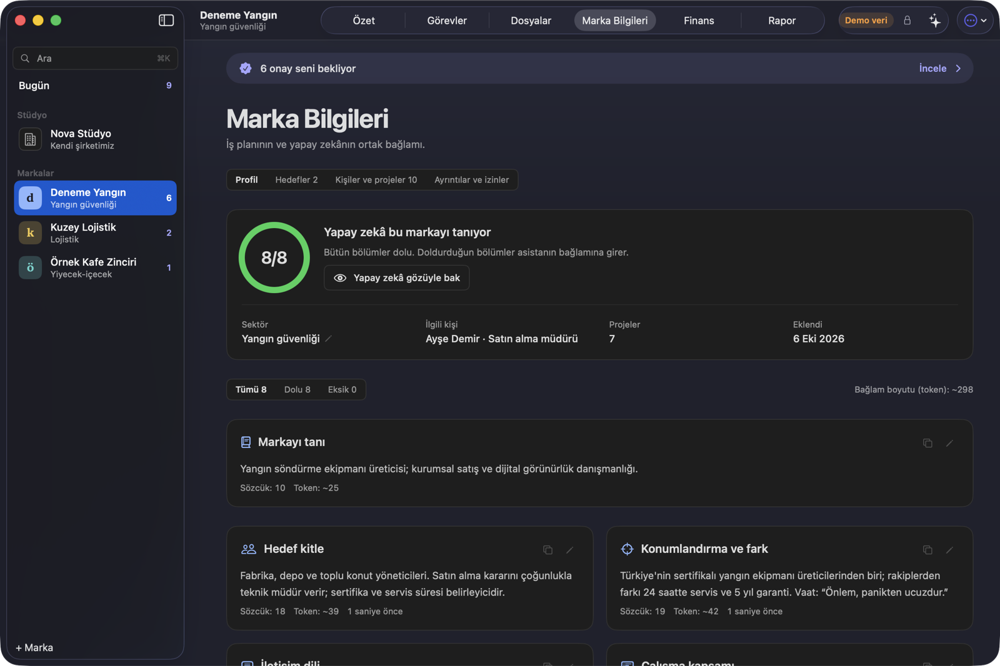
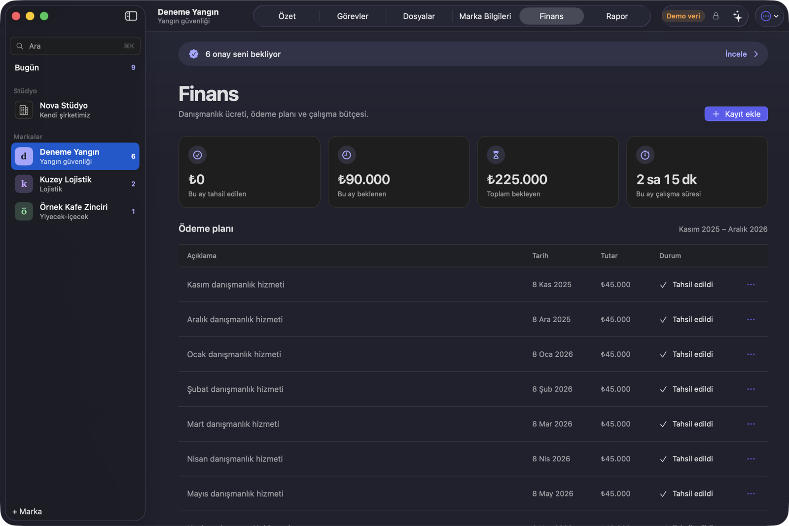
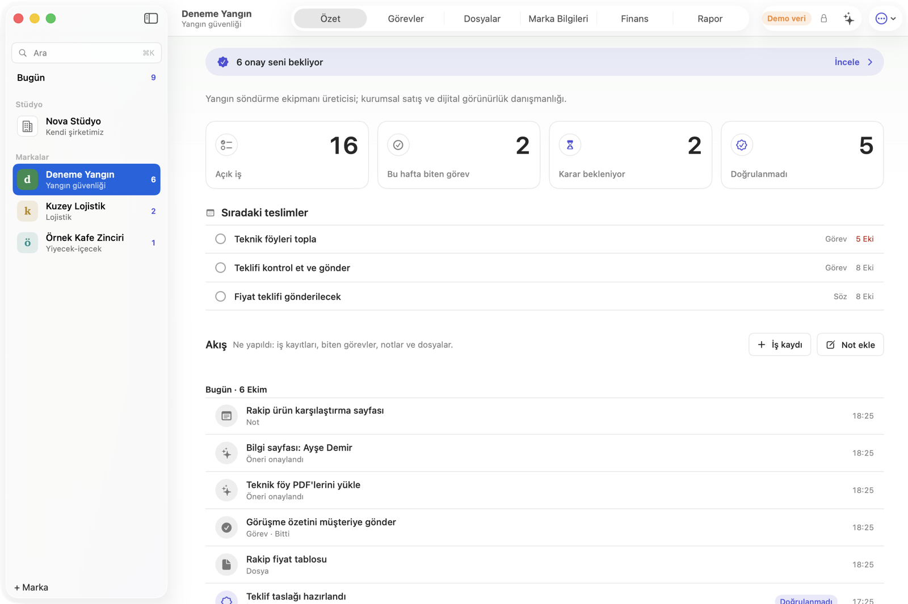

<div align="center">

# Workspace AI

**Marka Çalışma Alanı / Brand Workspace** — birden fazla markaya hizmet veren danışman için yerel bir macOS uygulaması.

*Bir markaya bakınca: ne yapıldı, ne bekliyor, müşteriye ne gidecek.*

[](#hızlı-başlangıç)
[](Package.swift)
[](Sources/MarkaApp)
[](Sources/MarkaCore/Database)
[](docs/ai-calisma-alani-plani.md)
[](#lisans)

[Ekranlar](#ekranlar) · [Nasıl çalışır](#nasıl-çalışır) · [Öne çıkanlar](#öne-çıkanlar) · [Hızlı başlangıç](#hızlı-başlangıç) · [Güvenlik](#veri-ve-marka-yalıtımı) · [Durum](#durum) · [Belgeler](#belgeler)

<br>

<picture>
  
</picture>

</div>

<br>

> Beta 0.4.0. Swift 6, SwiftUI, GRDB (SQLite). macOS 14 ve üzeri, Apple Silicon.

Ürünün güncel adı **Workspace AI**; depoda, paket adında ve eski belgelerde "Marka Çalışma Alanı / Brand Workspace" adı geçer, aynı üründür.

## Neden

Beş markaya hizmet veren biri için asıl soru hep aynı: *Bu markada en son ne yaptık, ne söz verdik, müşteriye ne göndereceğiz?* Üstüne bir de kendi şirketinin işleri biner: web sitesi, reklam, yeni müşteri görüşmeleri, ekip.

Workspace AI bu işleri tek yerde toplar: her markanın görevleri, dosyaları, bilgileri, finansı ve raporu bir arada; kendi şirketin de aynı biçimde bir iş alanıdır (Stüdyo). Yan paneldeki yapay zekâ asistanı markayı okur, ne yapacağını söyler, görev ve kayıt **önerir**. Sen onay sayfasında onaylarsın; onayladığın her şey geri alınabilir.

## Nasıl çalışır


```mermaid
flowchart LR
    S["Asistan paneli<br/>Claude API · Codex (opsiyonel)"] -- "öneri" --> O{"Onay sayfası<br/>tek yer"}
    D["Marka klasörü<br/>yeni dosyalar"] --> O
    O -- "Onayla (geri alınabilir)" --> K["Görevler · Dosyalar<br/>Marka Bilgileri · Finans"]
    K -- "doğrulanmış iş kayıtları" --> R["Rapor<br/>müşteriye ne gidecek"]
    R --> P(["PDF · e-posta taslağı"])
```

1. **Bilgi ver.** Marka Bilgileri'nde profili, hedefleri, kişileri ve projeleri yaz; dosyaları ekle. "Yapay zekâ gözüyle bak" asistanın okuyacağı bağlamı gösterir.
2. **Sor.** Sağdaki Asistan paneline "Ne yapmalıyım?" ya da "Cuma teslimi için görev aç" yaz. Asistan o markanın kayıtlarını okur; yazmaz.
3. **Onayla.** Asistanın önerdiği görev, iş kaydı, not, bilgi sayfası güncellemesi ya da dosya, onay sayfasına düşer: *"5 onay bekliyor · İncele"*. Seçtiklerini onaylarsın, seçmediklerin bekler.
4. **Raporla.** Rapor yalnızca doğrulanmış iş kayıtlarından oluşur; her maddenin bir dayanağı vardır. *Hazır, PDF al* ile filigransız PDF'i kaydedersin.

## Ekranlar

Aşağıdaki görüntüler uygulamanın gerçek penceresinden alındı; veri, depoyla gelen **uydurma örnek markalardır** (Deneme Yangın, Kuzey Lojistik, Örnek Kafe Zinciri).

<table>
  <tr>
    <td width="50%"><br><sub><b>Görevler.</b> Liste, Pano, Gantt ve Takvim; görev üzerinde zamanlayıcı.</sub></td>
    <td width="50%"><br><sub><b>Onay sayfası.</b> Asistanın önerileri tek yerde; mevcut kaydı değiştirenler ayrıca işaretlenir.</sub></td>
  </tr>
  <tr>
    <td width="50%"><br><sub><b>Rapor.</b> Yalnız doğrulanmış iş kayıtlarından; doğrulanmayan madde rapora girmez.</sub></td>
    <td width="50%"><br><sub><b>Marka Bilgileri.</b> Asistanın okuduğu bağlam ve doluluk göstergesi; yapay zekâ izni marka başınadır.</sub></td>
  </tr>
  <tr>
    <td width="50%"><br><sub><b>Finans.</b> Danışmanlık ücreti, ödeme planı, tahsilat durumu ve çalışma süresi.</sub></td>
    <td width="50%"><br><sub><b>Açık görünüm.</b> Arayüz açık ve koyu temada çizilir.</sub></td>
  </tr>
</table>

## Öne çıkanlar

| | |
|---|---|
| **Kenar çubuğu** | **Bugün** (tüm markalarda onay bekleyen, geciken, bu hafta yapılan, karar bekleyen), **Stüdyo** (kendi şirketin) ve **Markalar**. |
| **Marka ekranı** | Sekmeler: *Özet*, *Görevler*, *Dosyalar*, *Marka Bilgileri*, *Finans*, *Rapor*. |
| **Görevler** | Liste, Pano (sürükle-bırak), Gantt ve Takvim görünümleri. Görev üzerinde zamanlayıcı; çalışırken menü çubuğunda canlı süre, çentikli MacBook'ta çentikten sarkan küçük ada. |
| **Marka Bilgileri** | *Profil*, *Hedefler*, *Kişiler ve projeler*, *Ayrıntılar ve izinler*. Doldurduğun bölümler asistanın bağlamına girer. |
| **Stüdyo** | Kendi şirketin: *Özet*, *Görevler*, *Dosyalar*, *Şirket* (*Genel*, *Hizmetler*, *Ekip*, *Şema*, *Yetenekler*), *Finans*, *Rapor*. |
| **Asistan paneli** | Yan panelde sohbet (⌘J). Sağlayıcı: Claude API (kendi anahtarın) ya da isteğe bağlı Codex App Server. Tek marka sohbeti, tüm markalar sohbeti ve **ekip üyesi rolüyle** sohbet. |
| **Önerir, yazmaz** | Yapay zekâ veri değiştirmez, öneri üretir; öneri onay sayfasında onaylanınca uygulanır ve Akış'tan geri alınır. |
| **Ekip ve yetenekler** | İnsan ve yapay zekâ çalışanlar, organizasyon şeması, `SKILL.md` biçiminde yetenek kütüphanesi (hazır paket ya da kendi dosyan). "Çalışan öner" önerisi **yalnız Stüdyo sohbetinde** verilir; yapay zekâ çalışan bir rol tanımıdır, kendi başına çalışan süreç değildir. |
| **Hızlı erişim** | ⌘K komut paleti (marka, bölüm, komut ara; "Ne yapmalıyım?" diye yapay zekâya sor) ve menü çubuğu paneli (marka başına bekleyen onaylar, çalışan zamanlayıcı). |
| **Dayanaklı rapor** | Rapordaki her madde doğrulanmış bir iş kaydına bağlıdır. AI özeti, dayanak göstermeyen cümleyi atar. |
| **Değişmez kaynak** | Eklenen dosya ve notlar bir SQL tetikleyicisiyle korunur; yalnızca arşivlenir. Her yazma işlemi denetim kaydı bırakır. |
| **Yerel saklama** | Veriler Mac'te yerel saklanır, her gün otomatik yedek alınır (son 14 saklanır). Yapay zekâyı açtığın markanın içeriği, yalnız o marka için izin verdiğin sağlayıcıya (Anthropic ya da Codex) gönderilir. |
| **TR / EN** | Arayüz Türkçe ve İngilizce. |

## Hızlı başlangıç

**Gereksinimler:** macOS 14 veya üzeri, Apple Silicon, Xcode Command Line Tools (`xcode-select --install`). Xcode gerekmez.

```sh
git clone https://github.com/suleymanbagirgan/brand-workspace.git
cd brand-workspace
scripts/build-app.sh                  # ~/Applications/Workspace AI.app (ad-hoc imza)
open "$HOME/Applications/Workspace AI.app"
```

İlk açılışta yalnızca ilk markanın adı sorulur. Asistan için Ayarlar'dan (⌘,) Claude API anahtarını gir (Keychain'de saklanır) ya da Codex girişini yap; ardından asistanı kullanmak istediğin markada yapay zekâ iznini aç (Marka Bilgileri › *Ayrıntılar ve izinler*). İzin varsayılan olarak kapalıdır. Ayrıntılı anlatım: [Kullanım kılavuzu](docs/kullanim-kilavuzu.md).

<details>
<summary><b>Geliştirici komutları</b></summary>

<br>

```sh
scripts/test.sh                       # testler (Swift Testing); sayı belgede tutulmaz, bu komut sayar
python3 scripts/l10n.py check         # TR/EN çeviri ve çoğul kapsamı
scripts/ui-olcum.sh                   # arayüz sadelik ölçümü
scripts/release.sh                    # dist/MarkaCalismaAlani-<sürüm>.dmg
swift run MarkaDogrula codex          # gerçek Codex App Server ile uçtan uca doğrulama
swift run MarkaDogrula demo <klasör>  # sahte örnek çalışma alanı
```

Ekran çizimi, deneme veri alanı ve canlı Claude doğrulaması: [docs/gelistirme.md](docs/gelistirme.md).

</details>

| Kısayol | |
|---|---|
| <kbd>⌘</kbd><kbd>0</kbd> | Bugün |
| <kbd>⌘</kbd><kbd>9</kbd> | Stüdyo |
| <kbd>⌘</kbd><kbd>1</kbd> … <kbd>6</kbd> | Marka sekmeleri (Özet, Görevler, Dosyalar, Marka Bilgileri, Finans, Rapor sırasıyla) |
| <kbd>⌘</kbd><kbd>J</kbd> | Asistanı göster / gizle |
| <kbd>⌘</kbd><kbd>K</kbd> | Komut paleti |
| <kbd>⌘</kbd><kbd>F</kbd> | Tüm markalarda ara |
| <kbd>⌘</kbd><kbd>N</kbd> · <kbd>⇧</kbd><kbd>⌘</kbd><kbd>N</kbd> | Yeni görev · Yeni marka |

## Veri ve marka yalıtımı

Danışman için en büyük risk, bir müşterinin bilgisinin başka bir müşteriye sızmasıdır. Bu yüzden:

- **Veriler Mac'te yerel saklanır.** Yapay zekâyı açtığın markanın içeriği, yalnız o marka için izin verdiğin sağlayıcıya (Anthropic/Codex) gönderilir. İzin markaya özeldir ve varsayılan olarak kapalıdır; izinsiz sağlayıcıya istek gitmez.
- **Marka yalıtımı.** Her okuma ve yazma marka kimliğiyle kapsanır; asistanın araçları başka markanın kimliğini reddeder. Oturumun markası sonradan değişmez.
- **AI veri değiştirmez, öneri üretir.** Senin onayın olmadan hiçbir kayıt oluşmaz. Onaylanan her şey geri alınabilir.
- **Kaynak değişmez.** Ham dosya ve notlar SQL tetikleyicisiyle korunur.
- **Uygulama sembolik bağı izlemez.** Marka klasörü dışını gösteren dosya içe alınmaz.
- **Tanı bilgisi içerik taşımaz.** Marka adı, dosya metni, e-posta ya da dosya yolu yazılmaz; bir test bunu ayırt edici içerikle doğrular.

Codex seçeneği kullanılırsa her markanın Codex süreci ayrı başlar ve macOS sandbox profiliyle sarılır; ayrıntı ve açık kalan sınırlar [bilinen sınırlar](docs/bilinen-sinirlar.md) belgesinde.

## Durum

**Beta 0.4.0.** testler `scripts/test.sh` ile çalışır ve geçer (sayı belgeye yazılmaz, bayatlar); veri modeli ve güvence kuralları testli. Ama kısa bir dürüstlük notu:

- **Arayüz gerçek pencerede tıklanarak tam denenmedi.** Ekranlar uygulamanın kendi çizim kipinde ve testlerle doğrulandı. Elle deneme turu: [docs/elle-test-senaryosu.md](docs/elle-test-senaryosu.md).
- **Canlı Claude yanıtı denenmedi.** Claude API akışı kayıtlı yanıtlarla test edildi; gerçek anahtarla doğrulanmadı. Codex App Server gerçek hesapla uçtan uca doğrulandı.
- Yapay zekâ çalışan **rol tanımıdır**; ürettiği her şey öneridir ve onayı sendedir.
- **Mac App Store'da değil, sandbox yok.** Paket ad-hoc imzalıdır; başka bir Mac'te Gatekeeper uyarısı verir.
- **Yalnızca Apple Silicon.** Intel Mac'lerde açılmaz.

Tam liste: [docs/bilinen-sinirlar.md](docs/bilinen-sinirlar.md).

### Yol haritası

- [x] **0.1.0**: Çekirdek, AI katmanı, raporlar, yedekleme
- [x] **0.2.0**: Marka yalıtımı, beta paketi, içeriksiz tanı raporu
- [x] **0.2.1**: Braun sadeleştirmesi: tek onay yeri, kalıcı terminal oturumu (terminal 0.3.0'da kaldırıldı)
- [x] **0.3.0**: Asistan paneli, yeni tasarım dili, Finans, Marka Bilgileri, çentik zamanlayıcı
- [x] **0.4.0**: Stüdyo (kendi şirketin), ekip ve organizasyon şeması, yetenek kütüphanesi (SKILL.md), çalışan rolüyle sohbet, "çalışan öner" önerisi, migration öncesi otomatik yedek
- [ ] Eylem kaydı (Action Registry; ilk dilim koda girdi), gözlem katmanı, bağlam bütçesi: [plan](docs/ai-calisma-alani-plani.md)
- [ ] 5 danışmanla iki haftalık beta ([değerlendirme planı](docs/degerlendirme-plani.md))
- [ ] Developer ID ile imzalı ve notarize dağıtım

## Belgeler

| Belge | İçerik |
|---|---|
| [Kullanım kılavuzu](docs/kullanim-kilavuzu.md) | Ekran ekran anlatım ve güvence kuralları |
| [Bilinen sınırlar](docs/bilinen-sinirlar.md) | Doğrulanmayan ya da bilerek bırakılan her şey |
| [Geliştirme](docs/gelistirme.md) | Derleme, test, ekran çizimi, canlı doğrulama araçları |
| [Yapay zekâ çalışma alanı planı](docs/ai-calisma-alani-plani.md) | Güncel plan (0.4.0 sonrası) |
| [0.2.1 planı](docs/surum-0.2.1.md) | Eski sürüm: sadelik planı ve ölçülmüş sonuçlar (tarihsel) |
| [Dağıtım ve sağlayıcılar](docs/dagitim-ve-saglayicilar.md) | App Store ve doğrudan dağıtım, Claude ve Codex koşulları |
| [Beta kurulumu](docs/beta-kurulum.md) | Katılımcı için adım adım kurulum |

## Teknoloji

Swift 6 · SwiftUI · [GRDB.swift](https://github.com/groue/GRDB.swift) 7.11 (SQLite, WAL, tetikleyiciler) · Anthropic Messages API · OpenAI Codex App Server (opsiyonel)

```
Sources/
├── MarkaCore/      veri modeli, SQLite şeması, marka yalıtımı, AI sağlayıcıları, raporlar, yedek
├── MarkaApp/       SwiftUI arayüzü (Bugün, Stüdyo, marka sekmeleri, Asistan paneli, ⌘K)
└── MarkaDogrula/   canlı doğrulama aracı (gerçek Codex ve Claude ile, sahte veriyle)
Tests/MarkaCoreTests/  Swift Testing testleri
```

## Lisans

Tüm hakları saklıdır. Kaynak kodu inceleme amacıyla herkese açıktır; kopyalama, değiştirme ve dağıtım için izin verilmez. Üçüncü taraf bileşenler: [THIRD_PARTY_NOTICES.md](THIRD_PARTY_NOTICES.md). Geliştirmede kullanılan BMAD Method (MIT) depoya dahil değildir.
