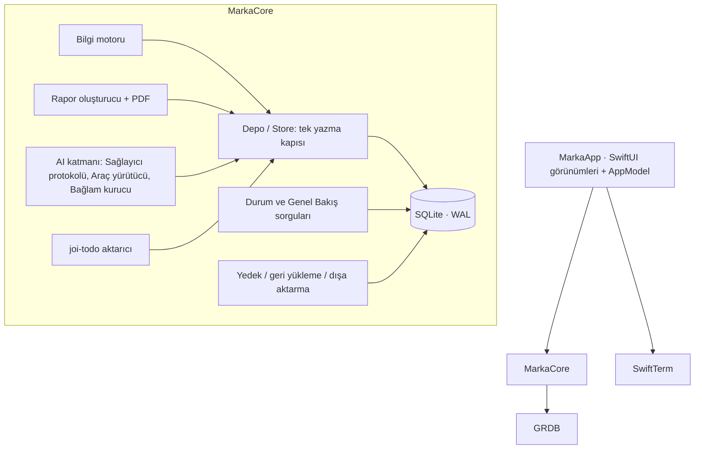
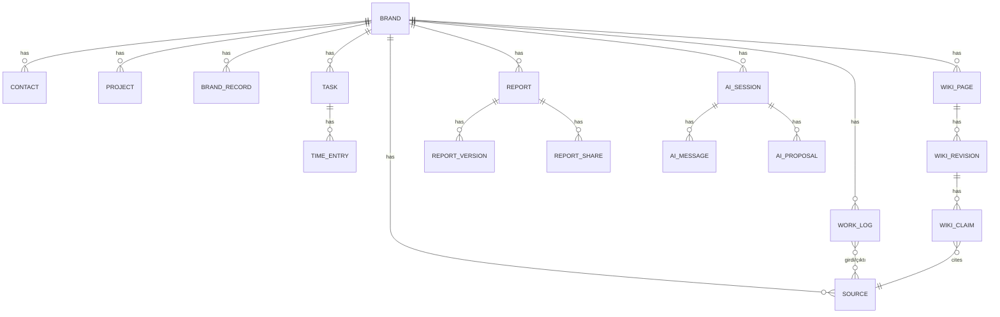

# Mimari Omurga — Marka Çalışma Alanı

## Tasarım Paradigması



- `Sources/MarkaCore` — kullanıcı arayüzü içermez; tüm iş kuralları ve testler burada.
- `Sources/MarkaApp` — SwiftUI; yalnızca `MarkaCore` API'sini çağırır; SQL yazmaz.
- Bağımlılık yönü tek: App → Core → GRDB. Core, App'i bilmez.

## Değişmezler ve Kurallar

### AD-1 — Tek doğruluk kaynağı: tek SQLite dosyası [ADOPTED]
- **Binds:** tümü
- **Prevents:** JSON dosyaları, önbellekler veya CLI'ların ayrı yazdığı ikinci bir durum.
- **Rule:** Kalıcı durum yalnızca `workspace.sqlite` ve içerik adresli `Files/` dizinidir. Terminal, Codex ve Claude Code veri tabanına doğrudan yazamaz; ürettikleri dosyalar Marka Klasöründe kalır ve kullanıcı onayıyla `Store` üzerinden Kaynak olur.

### AD-2 — Yazma yalnızca `Store` üzerinden, işlem içinde ve denetim olayıyla
- **Binds:** FR-7, FR-8, FR-10, FR-13
- **Prevents:** Denetimsiz değişiklik, geri alınamayan AI eylemi, eşzamanlı yazma yarışları.
- **Rule:** Her mutasyon `DatabasePool.write` içinde tek işlemdir ve aynı işlemde `auditEvent` (aktör, önce/sonra JSON) yazar. GRDB tek yazıcıyı serileştirir; okumalar WAL anlık görüntüsüdür.

### AD-3 — Kaynaklar değişmezdir
- **Binds:** FR-3, FR-9
- **Rule:** `source` tablosunda içerik sütunları için `BEFORE UPDATE` tetikleyicisi `RAISE(ABORT)` verir; yalnızca `archivedAt` değişebilir. Dosyalar `Files/<sha256>` altında salt okunur izinle saklanır.

### AD-4 — Marka yalıtımı sorgu katmanında zorunludur
- **Binds:** FR-13, FR-14
- **Prevents:** Bir markanın verisinin başka markanın oturumuna veya izin verilmeyen sağlayıcıya gitmesi.
- **Rule:** AI araç yürütücüsü oturumun `brandId` değerine bağlıdır; her kayıt kimliği yüklenince `brandId` karşılaştırılır, eşleşmezse `MarkaError.brandScope`. Bağlam kurucu yalnızca kapsam markasından veri okur. İstekten önce `brand.aiProviders` kontrol edilir; varsayılan boştur (izin yok).

### AD-5 — AI veri değiştirmez, öneri üretir
- **Binds:** FR-8, FR-10, FR-13
- **Rule:** Okuma araçları otomatik çalışır. Yazma niyetli araçlar `aiProposal` satırı üretir; `Store.applyProposal` kullanıcı eylemiyle çalışır ve geri alma bilgisini saklar.

### AD-6 — Raporlar yalnızca doğrulanmış kayıtlardan
- **Binds:** FR-16
- **Rule:** `ReportBuilder` deterministiktir; her `ReportItem.refs` boş olamaz. AI yalnızca özet cümlesi önerir; referansı madde kimlikleriyle eşleşmeyen cümle atılır.

### AD-7 — Sağlayıcı soyutlaması
- **Binds:** FR-14
- **Rule:** `ChatEngine` (actor) sağlayıcıdan bağımsız `AsyncStream<AIEvent>` yayar. Anthropic: URLSession + SSE, `POST /v1/messages`, istemci araçları. Codex: kullanıcının kurulu `codex app-server` süreci, JSON-RPC (satır sonlu JSON) stdio; iş parçacığı `cwd` = Marka Klasörü; her turda `workspaceWrite` (yazılabilir kök yok, /tmp ve ağ kapalı) + `on-request` onay; marka araçları `dynamicTools` ile verilir; onay istekleri UI'a iletilir; sunucu istekleri okuma döngüsünü bloklamadan ayrı görevde işlenir.

### AD-8 — Gizli bilgiler Keychain'de
- **Rule:** API anahtarları `kSecClassGenericPassword`, servis `com.markacalismaalani.app.<hesap>`, erişim `WhenUnlockedThisDeviceOnly`; veri tabanına, günlüğe veya dışa aktarıma yazılmaz.

### AD-9 — Şema geçişleri ileri yönlüdür
- **Rule:** `DatabaseMigrator` sıralı ve adlandırılmış geçişler; yayımlanmış geçiş değiştirilmez. Yedek dosyası `PRAGMA user_version` yerine GRDB `grdb_migrations` tablosuyla doğrulanır; bilinmeyen geçiş içeren yedek reddedilir.

## Tutarlılık Kuralları

| Konu | Kural |
| --- | --- |
| Kimlikler | UUID dizgesi (`TEXT PRIMARY KEY`), küçük harf |
| Tarih-saat | UTC `Date` (GRDB varsayılanı); gün alanları (son tarih) `yyyy-MM-dd` metin |
| Adlandırma | Swift türleri İngilizce; kullanıcı metni Türkçe anahtarlı `L("…")`; tablo ve sütun adları camelCase tekil (GRDB Codable eşlemesi) |
| Hatalar | `MarkaError` (LocalizedError); kullanıcıya Türkçe açıklama + kurtarma önerisi |
| Aktör | `actor` sütunu: `user`, `ai`, `import`, `system` |
| Para | Tahmini maliyet mikro-USD tamsayı |

## Yığın

| Ad | Sürüm |
| --- | --- |
| Swift | 6.x (dil kipi 6) |
| macOS hedefi | 14.0+ |
| GRDB.swift | 7.11.1 (MIT) |
| SwiftTerm | 1.19.0 (MIT; 1.20.0 ön sürüm olduğu için kullanılmadı) |
| SQLite FTS5 | sistem SQLite'ı |
| BMAD Method | 6.12.0 (MIT, yalnızca geliştirme) |

## Yapı Tohumu



```text
MarkaCalismaAlani/
  Package.swift
  Sources/MarkaCore/   # Model, Veritabanı, Store, Durum, Bilgi, Rapor, AI, Aktarım, Yedek
  Sources/MarkaApp/    # SwiftUI görünümleri
  Tests/MarkaCoreTests/
  Resources/           # Info.plist, tr/en Localizable.strings, simge
  scripts/             # build-app.sh, l10n.py, test.sh
  docs/                # değerlendirme planı, dağıtım, eski depo analizi
```

## Ertelenenler
- Senkronizasyon / çok cihaz — tek kullanıcı yerel ürün; ihtiyaç kanıtlanınca.
- Sparkle güncellemeleri — Developer ID imzası olmadan anlamsız.
- Gömülü embedding araması — FTS5 yeterli olduğu ölçülene kadar.
